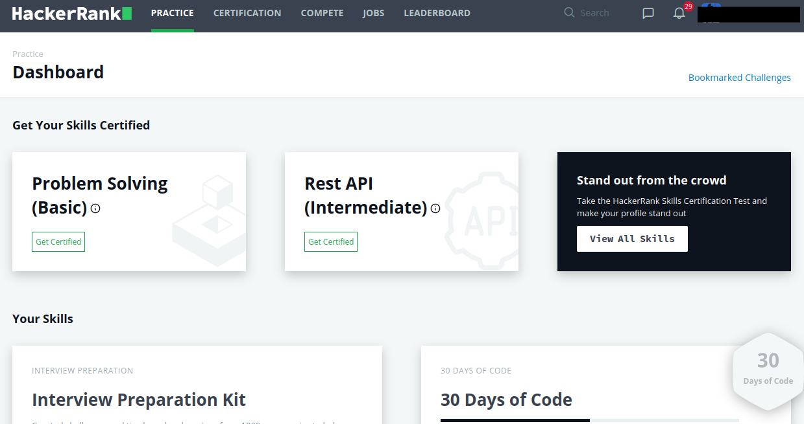
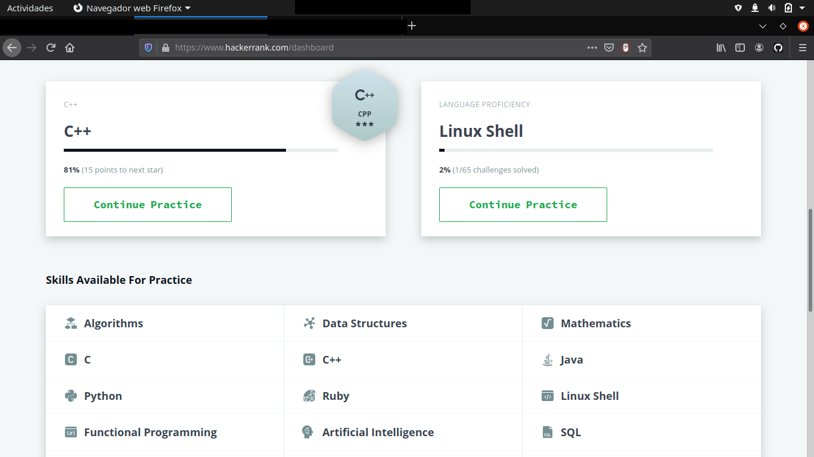
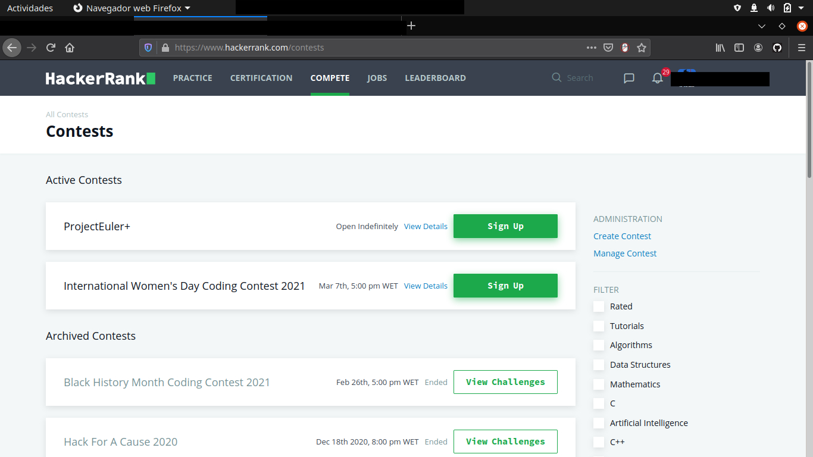
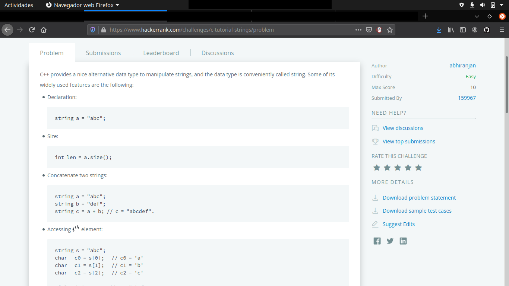
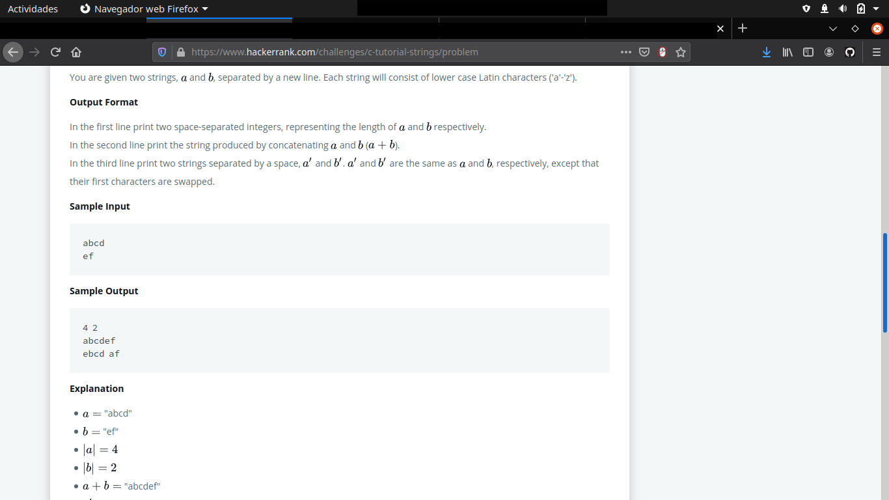
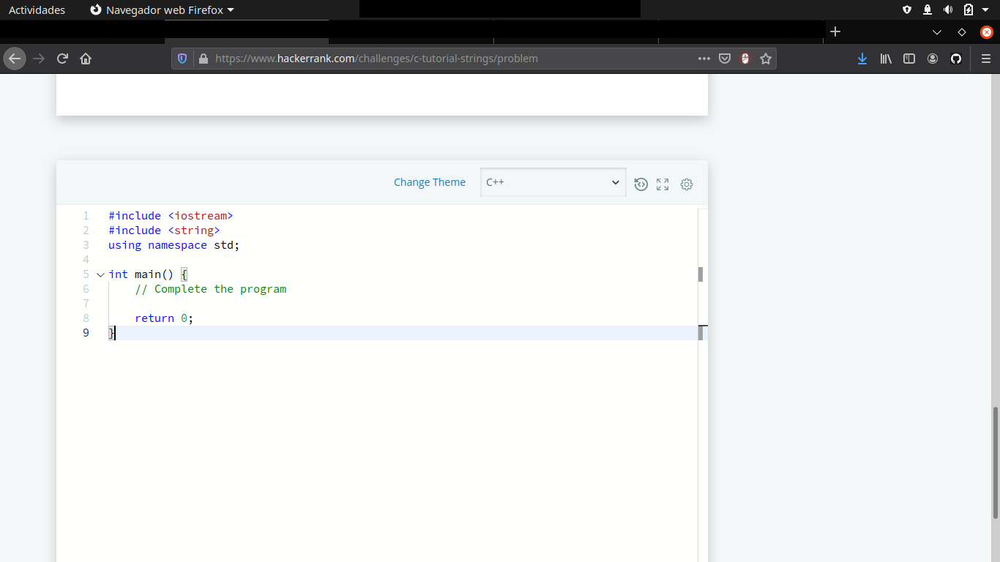

# ¿Qué debemos conocer sobre HackerRank?

## Índice

* [Acerca de](#id0)
* [Una vez registrados, ¿por donde empezar?](#id1)
* [Relación con Exercism.io](#id2)
* [Conclusiones y enlaces de interés](#id3)

**Acerca de**

HackerRank surge como una página web para ampliar nuestros conocimientos de programación e informática, pues podemos pasar de C, C++, Ruby a DataBases, SQL, LinuxShell, etc.

Su principal característica podría ser esta gran variedad de aprendizaje que nos ofrece, pero como vamos a proceder a ver, no se queda ahí, pues implementa diversas funcionalidades adicionales, tales como retos o incluso certificaciones.

[volver arriba](#top)

**Una vez registrados, ¿por donde empezar?**

Una vez iniciada la sesión, nos aparecerá algo similar a esto:

donde podemos ver las secciones de práctica, certificación, competición, trabajos y tabla de resultados.

**práctica/practice**

Aquí aparecerán todas las secciones en las que nos hayamos interesado, además de sugerencias de la propia página de cursos de aprendizaje que nos puedan llegar a interesar.

Haciendo scroll podemos ver algo simimilar cuando hayamos tomado algunos cursos de interés:

**certificación/certification**

Ofrece certificación de cursos mediante la realización de algunos test para demostrar las competencias adquiridas.

**competición/compete**

Nos ofrece la oportunidad de participar en pequeños retos relacionados con los lenguajes de programación con los que estemos trabajando.

[volver arriba](#top)

**Relación con Exercism.io**

HackerRank organiza nuestras soluciones de la siguiente manera:
Cada problema tiene asociada una puntuacion maxima que sera conseguida cuando el codigo que suba el usuario pase todos los casos de entrada a los que se le somete.
Supongamos que existen 10 casos de entrada en un determinado problema; si el codigo subido por el usuario supera 6 de los 10 casos de entrada, la puntuacion obtenida en ese problema sera de 60 puntos.

Como podemos ver es algo similar a Exercism en cuanto a que también nos ofrece una serie de ejercicios a realizar y ver sus posibles soluciones, sin embargo, HackerRank está más enfocada a la realización de dichos ejercicios de manera online, ofreciéndonos un editor de código online en cada uno de los ejercicios, veamos un ejemplo:

Como podemos observar, en el apartado de "NEED HELP?" nos ofrece algo similar a lo que Exercism.io en cuanto a buscar soluciones de otros programadores. Además podemos ver los ejercicios mejor resueltos, y descargas las soluciones a nuestro ordenador en el apartado "MORE DETAILS".

[volver arriba](#top)

**Conclusiones y enlaces de interés**

Como conclusión a este artículo, es de destacar que esta página difiere de Exercism en cuanto a la manera de trabajar, puesto que si preferimos trabajar desde nuestro IDE personal, será mucho más sencillo trabajar desde Exercism, sin embargo, considero a HackerRank una buena alternativa a Exercism por el hecho de ser una página enfocada a distintos ámbitos como se mencionaba en apartados anteriores, y por funcionalidades que la convierten "adictiva", tales como los retos, o ganar puntuación por programar cada día durante un mes seguido. Además, la posibilidad de categorizar una solución, te permite saber el desempeño que has realizado, pudiendo comparar con las mejores respuestas y aprender a ser más eficiente en tu código para futuros desarrollos.

Enlaces de interés:

[HackerRank](https://www.hackerrank.com)

[Exercism.io](https://exercism.io)

[Recursos de HackerRank](https://www.hackerrank.com/resources/?h_r=developer_skills_platform&h_l=header#guides)

[volver arriba](#top)